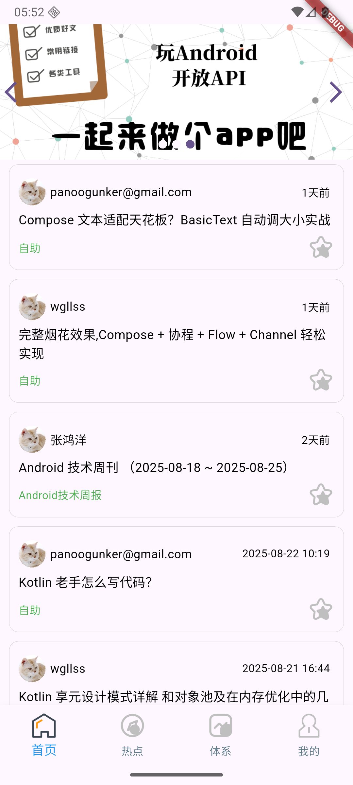

# Wan Android Flutter客户端

## 项目简介

一个使用Flutter开发的学习型Wan
Android第三方客户端，基于[Wan Android开放API](https://www.wanandroid.com/blog/show/2)构建。项目实现了Wan
Android网站的主要功能，包括文章浏览、知识体系查看、热门关键词搜索、用户登录注册、文章收藏等核心功能。

项目遵循现代化的Flutter开发规范，采用MVVM架构模式，使用Provider进行状态管理，具有良好的代码结构和可维护性。

## 项目亮点

- **完整功能实现**：涵盖首页、热点、知识体系、个人中心四大模块
- **规范架构设计**：采用MVVM模式，分离业务逻辑与UI展示
- **响应式UI设计**：适配不同屏幕尺寸，提供良好的用户体验
- **完善的网络处理**：集成Dio网络库，实现拦截器、错误处理等机制
- **数据持久化**：使用shared_preferences进行本地数据存储
- **WebView集成**：内置网页浏览功能，支持文章详情查看
- **下拉刷新与上拉加载**：集成pull_to_refresh库，提供流畅的数据加载体验

## 技术实现

### 核心技术栈

- **Flutter**：Google推出的跨平台UI框架
- **Dart**：Flutter官方开发语言
- **Provider**：状态管理解决方案
- **Dio**：易用的HTTP客户端
- **pull_to_refresh**：下拉刷新和上拉加载组件

### 主要功能模块

1. **首页模块**
    - 轮播图展示
    - 文章列表展示（包含置顶文章）
    - 文章收藏功能

2. **热点模块**
    - 常用网站导航
    - 搜索热词展示
    - 文章搜索功能

3. **知识体系模块**
    - 知识体系分类展示
    - 分类下文章列表查看

4. **个人中心模块**
    - 用户登录/注册
    - 我的收藏查看
    - 退出登录功能

### 第三方库依赖

- `flutter_screenutil`：屏幕适配方案
- `oktoast`：轻量级Toast提示
- `flutter_swiper_view`：轮播图组件
- `shared_preferences`：本地数据存储
- `flutter_html`：HTML内容渲染
- `flutter_inappwebview`：内置WebView
- `package_info_plus`：应用包信息获取

## 快速开始

### 环境要求

- Flutter 3.9.0或更高版本
- Dart SDK 3.9.0或更高版本

### 安装运行

1. 克隆项目

```bash
git clone https://github.com/huojieren/Wan-Android.git
```

2. 获取依赖

```bash
bash flutter pub get
```

3. 运行项目

```bash
flutter run
```

## API文档

本项目使用[Wan Android开放API](https://www.wanandroid.com/blog/show/2)，感谢该平台提供的学习资源。

## 项目截图

<div style="display:flex; flex-wrap:wrap;">
  
  
  
</div>
<br/>
<div style="display:flex; flex-wrap:wrap;">
  
  
  
</div>

## 致谢

特别感谢[Wan Android](https://www.wanandroid.com)提供的开放API和学习资源。
